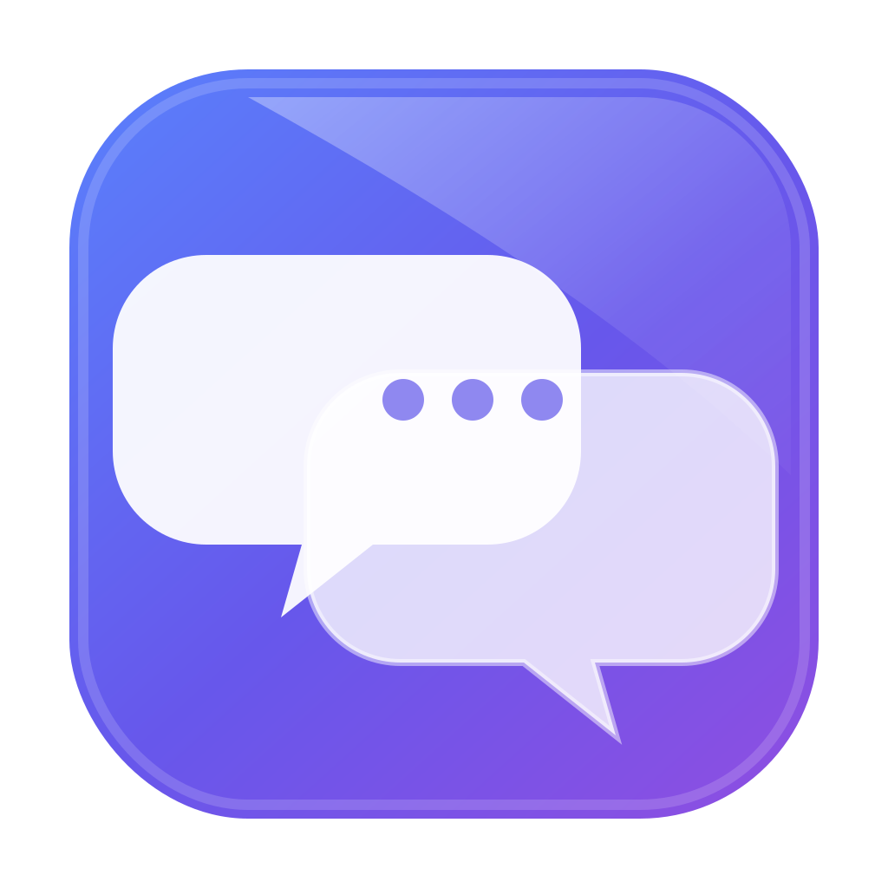
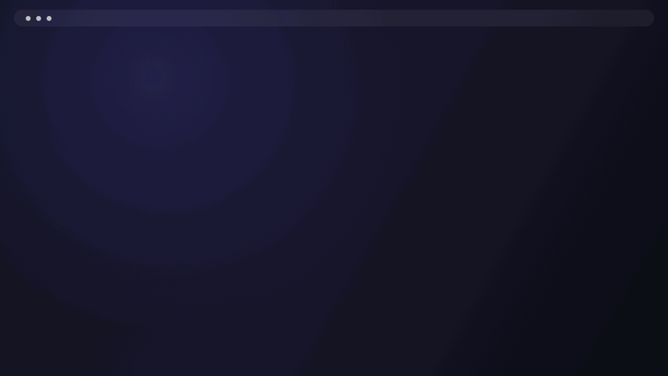

<div align="center">
  
  <h1>SideCord</h1>
  <p>
    <strong>Discord, one edge away.</strong><br>
    A native macOS sidebar that keeps your Discord session close without taking over your desktop.
  </p>
  <p>
    
    
    <a href="https://github.com/MathieuDvv/SideCord/releases/latest"></a>
  </p>
  <p>
    <a href="https://github.com/MathieuDvv/SideCord/releases/latest"><strong>Download the latest DMG</strong></a>
    &nbsp;·&nbsp;
    <a href="#build-from-source">Build from source</a>
  </p>
</div>

<picture>
  <source media="(prefers-reduced-motion: reduce)" srcset="docs/assets/sidecord-demo-still.png">
  
</picture>

SideCord lives in the menu bar and reveals a resizable Discord panel from the left or right edge of any display. It follows you across Spaces, remembers each display's width, and keeps the web session alive when the panel retracts.

<table>
  <tr>
    <td width="33%"><strong>Edge-native</strong><br>Hover at the configured edge or use a global shortcut. SideCord appears on the display you are using.</td>
    <td width="33%"><strong>Space-aware</strong><br>The nonactivating panel follows every Space, including full-screen apps, without pulling you back to another desktop.</td>
    <td width="33%"><strong>Made to fit</strong><br>Choose a focused, reader, full, or custom Discord layout with compact density and native-feeling themes.</td>
  </tr>
</table>

## A quieter notification glow

New Discord activity produces a soft light on the configured screen edge. It grows from the middle, fades before reaching either corner, and dissolves without interrupting what you are doing.

- Normal notifications pulse once, then disappear softly.
- Rapid notifications restart the pulse instead of being time-coalesced, so later deliveries are not dropped.
- Incoming calls keep a gentle breathing glow until you open SideCord or the ringing ends.
- An optional detached call card shows the transient caller or group name with Answer and Decline. If Discord's controls cannot be matched safely, SideCord opens the call UI instead.
- Revealing SideCord acknowledges the current call, so the glow does not return when the same call is still ringing.
- The glow follows your selected accent, works on either edge, remains click-through, and respects macOS Reduce Motion.
- Ordinary attention signals carry only an event boolean. While a call is visibly ringing, the call bridge additionally carries a bounded display name and transient call identifier in memory. The separate floating-rail bridge carries server IDs, names, icons, selection, and unread state; no bridge carries message text, senders, channel names, or notification content.

You can turn the effect off at any time in **Settings → Sidebar → Glow for Discord activity**.

## Onboarding and settings

First launch now happens in place: the active display dims transparently, the configured edge glows, and the real SideCord panel slides in with Discord's existing sign-in flow. After sign-in—or by choosing to continue without it—a detached setup card guides you through placement, layout, appearance, and launch behavior one focused step at a time. Choosing **Finish** or clicking the backdrop saves those choices and retracts SideCord.

SideCord's controls live inside Discord's own settings screen under a native-styled **SideCord** category in the left navigation. Selecting it keeps Discord's settings shell in place and changes only the right-hand settings content; SideCord doesn't open a separate settings surface.

## Highlights

- Persistent `WKWebView` session; retracting SideCord never reloads Discord
- Edge-hover reveal plus configurable panel and navigation shortcuts
- Left or right placement, floating inset, pinning, maximize/restore, and per-display widths
- Full, Focus, Reader, and Custom layouts with an optional floating server rail
- Settings integrated into Discord's native navigation, plus floating-rail controls in the top pill
- System Glass, Discord, OLED, and Soft palettes with automatic or forced appearance
- White and independent glow colors, three glow strengths, and native incoming-call controls
- Declarative JSON plugins for reviewed themes, layouts, safe styles, allow-listed commands, and isolated host-managed web panels
- Signed marketplace catalog and package-hash verification when configured by a release build
- Compact density, essential composer controls, and conservative local custom CSS
- Native handling for attachments, downloads, camera, microphone, login popups, and QR login
- Launch at Login and macOS Reduce Motion / Reduce Transparency support

## Install

1. Download the latest `.dmg` from [Releases](https://github.com/MathieuDvv/SideCord/releases/latest).
2. Open it and drag **SideCord** into **Applications**.
3. Launch SideCord from Applications. If Gatekeeper blocks the first launch, Control-click the app, choose **Open**, then confirm.

> Current community builds are unsigned and not notarized. Developer ID signing and Apple notarization are required for a warning-free public distribution.

SideCord requires **macOS 26 or newer**.

## Everyday controls

| Action | Default |
|---|---|
| Show or hide SideCord | `⌥ D` |
| Toggle compact Discord navigation | `⌥ ⇧ D` |
| Reveal with the pointer | Rest at the configured screen edge |
| Pin, maximize, change layout, or open Settings | Use the top control pill |

Both shortcuts can be changed in Settings.

<details id="build-from-source">
<summary><strong>Build from source</strong></summary>

### Requirements

- macOS 26
- Xcode 26
- [XcodeGen](https://github.com/yonaskolb/XcodeGen)

Generate the checked-in Xcode project after changing `project.yml`:

```sh
xcodegen generate
```

Build and test:

```sh
DEVELOPER_DIR=/Applications/Xcode.app/Contents/Developer \
  xcodebuild -project SideCord.xcodeproj -scheme SideCord \
  -destination 'platform=macOS' build

DEVELOPER_DIR=/Applications/Xcode.app/Contents/Developer \
  xcodebuild -project SideCord.xcodeproj -scheme SideCord \
  -destination 'platform=macOS' test
```

Set a development team in Xcode for a locally signed build. The README animation is reproducible with:

```sh
DEVELOPER_DIR=/Applications/Xcode.app/Contents/Developer \
  xcrun swift Design/generate-readme-animation.swift
```

</details>

## Privacy and permissions

SideCord has no analytics and does not inspect Discord credentials or tokens. Its App Sandbox entitlements allow outgoing network access, files you explicitly select, and camera or microphone access only when Discord requests them for a call. See [PRIVACY.md](PRIVACY.md) for the complete policy.

Discord can change its web interface or embedded-browser support at any time, so focused layout selectors and attention signals may occasionally need an update.

## Plugins

SideCord plugins are declarative JSON packages, not executable extensions. They can contribute validated styles, theme and layout recipes, commands assembled from SideCord's built-in actions, and schema v2 web panels. A web panel may load declared HTTPS sites in a SideCord-owned browser profile isolated from Discord; the package still cannot supply JavaScript or native code and receives no native bridge. See [the plugin format and marketplace security model](docs/PLUGINS.md).

<p align="center"><sub>SideCord is independent software and is not affiliated with Discord Inc.</sub></p>
